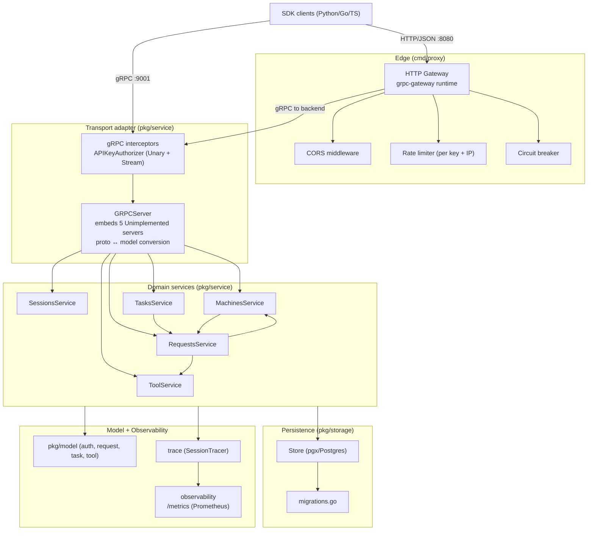
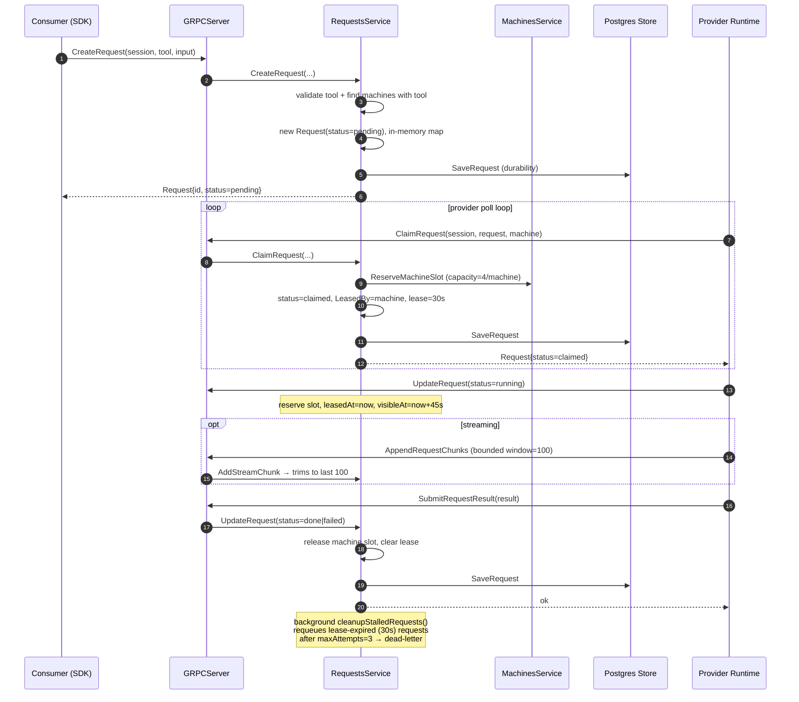

# Architecture

> Toolplane is a **control plane for remote tool execution**: tools that may
> outlive a single caller/process/deploy. The Go server owns request lifecycle,
> machine ownership, retained-window replay, and drain semantics. Everything
> else (SDKs, adapter, gateway) is a projection of one protobuf contract.

## Core Sections (Required)

### 1) Architectural Style

Layered domain-service architecture in Go with a transport adapter on top:

- **Contract layer**: `server/proto/service.proto` is the single source of truth.
  All 5 gRPC services are defined here, each RPC annotated with a
  `google.api.http` option so grpc-gateway can produce the HTTP surface.
- **Transport adapter layer**: `server/pkg/service/server.go` (`GRPCServer`)
  embeds all 5 `Unimplemented*Server` types, converts proto ↔ model, maps
  errors to gRPC status codes, and delegates to domain services. Deliberately
  thin — business logic lives in domain files.
- **Domain service layer**: `server/pkg/service/{tool,session,machine,requests,task}.go`.
  Each file owns one entity family. Services are constructed once in `main.go`
  and hold shared dependencies (`store`, `tracer`, sibling services).
- **Persistence layer**: `server/pkg/storage/` — a `Store` over Postgres
  (`pgx`), with per-entity files and migrations in `migrations.go`. Optional;
  when absent, services run in-memory.
- **Edge / gateway layer**: `server/cmd/proxy/` — grpc-gateway reverse proxy
  adding CORS, per-key/IP rate limiting, circuit breaker, and a health endpoint.

Pattern note: this is **layer + domain** organization, not strict
controller→service→repository. The transport adapter is a single gRPC-facing
struct; domain services do their own in-memory state management plus optional
Postgres persistence (dual-write: in-memory map is authoritative for hot path,
Postgres is the durability/recovery store).

### 2) Layer Diagram

Edge label: `HTTP/JSON` for the gateway path; `gRPC` for the direct client path
and the gateway→backend hop.

### 3) Service Construction & Wiring

In `server/cmd/server/main.go` (single explicit initialization order):

1. Load + validate `serverConfig` from env (`loadServerConfig`) — production
   guards reject insecure combinations.
2. Build observability: `RuntimeMetricsCollector` + `SessionTracer`.
3. Open storage via `storage.OpenFromEnv` → `*Store` (or in-memory if
   `STORAGE_MODE=memory`).
4. Construct domain services in dependency order:
   `sessionSvc → toolSvc → machineSvc → requestSvc → tasksSvc`.
5. `metricsCollector.Bind(requestSvc, machineSvc, tasksSvc)` — gauges pull from
   live services.
6. Build authenticator from config (`disabled` | `fixed` | `postgres`); wrap
   with `APIKeyAuthorizer` as gRPC unary+stream interceptors.
7. `grpc.NewServer(...)`, register all 5 services, start metrics HTTP server,
   install SIGINT/SIGTERM graceful-stop handler.

`RequestsService` construction (`requests.go:64-103`) also starts a background
goroutine `cleanupStalledRequests()` and, when a store exists, loads all prior
requests into the in-memory map for restart recovery.

### 4) Request Lifecycle (the central data flow)

This is the control plane's core differentiator. A request is created by a
consumer, claimed and executed by a provider machine, and may be inspected or
resumed after disconnect.

Key timing constants (`server/pkg/service/constants.go`): heartbeat TTL 5m,
lease duration 30s, dispatch interval 2s, request timeout 45s, retry backoff 5s,
max 4 concurrent requests/machine, max 3 attempts, max 100 retained stream
chunks (`model/request.go:194-198`).

### 5) Streaming + Retained-Window Replay

`StreamExecuteTool` and `ResumeStream` (proto lines 52-66) provide bounded
replay after disconnect. The server retains the last 100 chunks per request
(`maxRequestStreamChunks`). Each chunk gets an **absolute sequence number**
(`AddStreamChunk`, `request.go:135-147`). `ResumeStream(last_seq)` replays from
`last_seq+1`; if that falls before `streamStartSeq`, the server returns
`OUT_OF_RANGE` (`RequestStreamExpiredError`, `requests.go:52-61`). The terminal
chunk uses the request's current `next_seq`.

### 6) Machine Drain

`DrainMachine` (`machine.go` + proto lines 214-220) stops **new** work routing
immediately but lets in-flight requests finish or age out before unregistering.
This is the deploy-safe rollout mechanism. `MachinesService.SetRequestTracker`
wires the bidirectional dependency so machine drain can observe request state.

### 7) Authentication & Authorization

Two-phase per-RPC enforcement (`server/cmd/server/auth/authorizer.go`):

1. **Authenticate**: extract token from gRPC metadata (`Authorization`,
   `api_key`, `X-API-Key`), resolve to an `AuthPrincipal` via the configured
   validator (fixed fixture / postgres `api_keys` table).
2. **Authorize**: a static `methodPolicies` map (lines 300-343) defines per-RPC
   `{Capability, BindSession, BindUser}`. Capabilities are `read` | `execute` |
   `admin` (`model/auth.go:11-15`). Session/user binding prevents cross-session
   access. `fixed` mode bypasses capability checks.

### 8) Background Workers / Async Components

| Component | Mechanism | Evidence |
|-----------|-----------|----------|
| Stalled-request requeue | `go service.cleanupStalledRequests()` goroutine | `requests.go:100` |
| Task orchestration | `TasksService` constructed with `ctx`, owns retry/timeout | `main.go:88`; `task.go` |
| Lease expiry / dispatch | timed loops using `dispatchInterval`/`leaseDuration` | `constants.go` |
| Metrics server | separate HTTP server on `:9102` (Prometheus) | `main.go:146-172` |

No external message queue (Kafka/SQS/NATS/RabbitMQ/Redis) is used, and none is
planned (confirmed with owner: "queue-backed" always meant the internal
Postgres-backed queue). A repo-wide `git grep` for broker names finds zero
references in the server, `server/go.mod`, or the storage layer; the single hit
is in `clients/python-client/toolplane/toolkits/README.md` — an aspirational
modernization note inside an example-toolkit doc, not a runtime dependency. The
"queue-backed" wording in `SDK_MAP.md` refers to the **internal** request queue:
the pending-request rows in Postgres, claimed via
`SELECT ... FOR UPDATE SKIP LOCKED` (`storage/requests.go:113`), with an
in-process map acting as a cache.

**Scaling direction (confirmed and implemented):** multi-instance active-active
is the intended deployment model, and the store-first rework makes the service
layer safe for it. The storage layer uses guarded primitives —
`store.ClaimRequest` and `store.LeasePendingRequest` (`SELECT ... FOR UPDATE
SKIP LOCKED` in `SERIALIZABLE` transactions), `store.ReclaimExpiredRequest`
(guarded lease-expiry reclaim), and `store.MachineInFlightCount` (shared
capacity) — so two or more server replicas sharing one Postgres store cannot
double-dispatch, double-requeue, or exceed per-machine capacity. The request
write paths persist-first and surface persistence errors. The lease-expiry and
dead-machine background loops honor the root context for graceful shutdown, and
non-terminal tasks are re-adopted on startup. Proof: `TestActiveActive_*` in
`server/pkg/service/request_activeactive_test.go` plus the storage contract
suite in `server/pkg/storage/storage_test.go`, both run by
`make release-gate-runtime` (drill D7). See `docs/codebase/CONCERNS.md` §3 for
the pre-rework record and resolution.

### 9) Design Patterns Observed

- **Adapter**: `GRPCServer` adapts domain services to the gRPC interface.
- **Strategy**: authenticator chosen by config (`disabled`/`fixed`/`postgres`);
  Python client `factories/` for transport selection.
- **Interceptor chain**: gRPC unary+stream interceptors for cross-cutting auth.
- **Repository**: `pkg/storage/*` per-entity files (`requests.go`, `sessions.go`…).
- **Dual-store**: in-memory authoritative + optional Postgres for durability.
- **Provider Runtime** (Python `provider_runtime.py`, TS `provider_runtime.ts`):
  encapsulates claim→heartbeat→submit→drain loop so edge adapters stay thin.

### 10) Evidence

- `server/cmd/server/main.go` (wiring + init order)
- `server/pkg/service/server.go` (transport adapter), `requests.go`, `machine.go`, `task.go`, `session.go`, `tool.go`
- `server/pkg/service/constants.go` (timing), `server/pkg/model/request.go` (lifecycle + chunk window)
- `server/pkg/storage/store.go`, `server/pkg/storage/migrations.go`
- `server/cmd/server/auth/authorizer.go` (method policies), `server/cmd/server/config.go`
- `server/cmd/proxy/main.go` (gateway), `server/proto/service.proto` (contract)
- `SDK_MAP.md` (integration seam layers), `conformance/README.md` (drill mapping)
