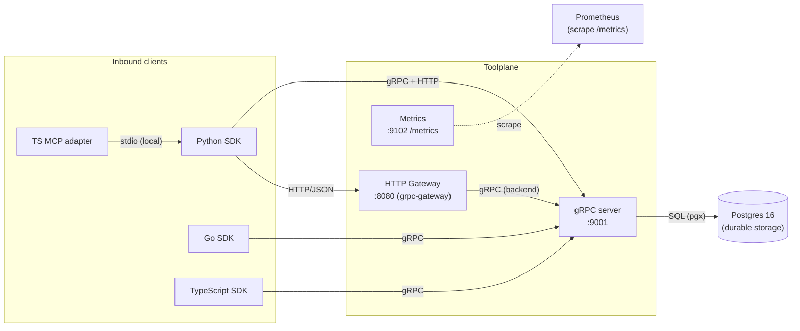

# External Integrations

> Toolplane integrates with **few** external systems by design — it is the
> control plane other systems integrate *with*. The only hard external runtime
> dependency is Postgres (production). Everything else is an inbound protocol
> surface or an observability emitter.

## Core Sections (Required)

### 1) External Dependency Map

### 2) Databases

| System | Driver | Role | Evidence |
|--------|--------|------|----------|
| PostgreSQL (16 in CI/reference) | `github.com/jackc/pgx/v5` via `database/sql` | Durable storage for sessions, api_keys, machines, tools, requests, tasks, user_sessions | `server/pkg/storage/store.go:13,57`; `server/deploy/reference/compose.yaml`; `.github/workflows/release-gate.yml:25` |

Connection pool settings are explicit: max/idle 25 conns, idle 5m, lifetime 60m
(`store.go:62-65`). Migrations run on startup (`store.go:75`) and via the
`--migrate-only` flag. Transactions use `SERIALIZABLE` isolation for claim and
capacity safety (`store.go:96`). Request claiming uses
`SELECT ... FOR UPDATE SKIP LOCKED LIMIT 1` (`storage/requests.go:113`) — the
multi-instance-safe queue primitive, so the **storage layer is multi-replica
safe** on the Postgres path (the service layer's in-memory map is not; see
`docs/codebase/CONCERNS.md` §3). Schema is defined in
`server/pkg/storage/migrations.go` (7 tables + indexes).

**In-memory mode** (`STORAGE_MODE=memory`) is development/CI-only and is
**forbidden in production** by config validation (`config.go:70-72`).

### 3) Authentication / Identity

| Mechanism | Mode | Evidence |
|-----------|------|----------|
| Fixed fixture token | `TOOLPLANE_AUTH_MODE=fixed` (dev/test only) | `cmd/server/auth/auth_static.go`; `config.go:46-52` |
| Postgres-backed API keys | `TOOLPLANE_AUTH_MODE=postgres` (production) | `SessionsService.AuthenticateAPIKey`; `api_keys` table in `migrations.go:23-34` |
| Disabled | `TOOLPLANE_AUTH_MODE=disabled` (non-production only) | `config.go:42-45` |

API keys carry capabilities (`read`/`execute`/`admin`) and are session-scoped.
The key secret is stored hashed (`key_hash`) with a non-secret `key_preview`;
`CreateApiKey` returns the secret once, `ListApiKeys` returns metadata only
(`migrations.go:23-34`; proto `ApiKey` lines 352-364). No OAuth/OIDC/SAML
integration is present in the maintained code.

### 4) Inbound Protocol Surfaces

| Surface | Protocol | Port | Evidence |
|---------|----------|------|----------|
| Canonical API | gRPC (HTTP/2) | 9001 | `server/cmd/server/main.go:29,100-138`; proto `service.proto` |
| Compatibility API | HTTP/JSON via grpc-gateway | 8080 | `server/cmd/proxy/main.go:262,368`; proto `google.api.http` annotations |
| Metrics | Prometheus text exposition | 9102 | `main.go:31,146-172`; `runtime_metrics.go:54-58` |
| Health (proxy) | HTTP JSON `/health` | 8080 | `proxy/main.go:203-206` |

gRPC services exposed: `ToolService`, `SessionsService`, `MachinesService`,
`RequestsService`, `TasksService` (`main.go:134-138`). The legacy `/rpc`
JSON-RPC endpoint is documented as a removal path to v2.0.0, outside maintained
parity (`SDK_MAP.md:64-66`; `server/docs/rpc-retirement.md`). **Validation
note**: a repo-wide `grep` for `/rpc`, `jsonrpc`, `RegisterRpc`, and rpc handler
registration across `server/` finds **no JSON-RPC handler in the maintained
server code** — the only explicit `HandleFunc` in the gateway is `/health`
(`cmd/proxy/main.go:203`), and all other routes come from grpc-gateway handler
registration off proto annotations. So the `rpc-retirement.md` claim ("remaining
removal work is now server-side only") is in fact already complete on the server
side; the doc is describing a state that no longer exists in code.

### 5) Outbound / Cross-Service Calls

- The HTTP gateway makes **outbound gRPC** calls to the backend server
  (`grpcEndpoint`, default `localhost:9001`) with keepalive, max message size,
  and a 30s default unary deadline (`proxy/main.go:264,291-318`).
- Backend TLS is configurable: `TOOLPLANE_PROXY_ALLOW_INSECURE_BACKEND` (default
  insecure in dev, **forbidden insecure in production**), optional server-name
  override and custom CA bundle (`proxy/config.go:25-36`).
- **No outbound calls** to third-party APIs (no `fetch`/`http.Get` to external
  hosts) exist in the server runtime. The Python `requirements.txt` lists
  `langchain`/`google-api-python-client` but these are used by bundled example
  tools, not the server.

### 6) Observability

- **Metrics**: Prometheus-style at `/metrics` (request pending/claimed/running/
  dead-letter, machine active/draining/inflight, task pending/running/failed,
  plus counters for requeues, dead-letters, retries). Gauges are pulled live
  from bound services (`runtime_metrics.go:77-`).
- **Tracing**: internal `SessionTracer` event bus (request lifecycle, auth
  decisions) — not OpenTelemetry/Jaeger. [TODO] — no distributed-tracing
  export (OTLP) is wired; confirm whether one is intended.
- **Logging**: stdlib `log` only.

### 7) Network Security

- gRPC server TLS via `--tls-cert-file` / `--tls-key-file`
  (`cmd/server/tls.go`, `main.go:33-34,42-45`). Production reference stack
  mounts certs at `/certs/server.{crt,key}` (`compose.yaml` server command).
- Gateway CORS is explicit allow-list in production; `*` wildcard forbidden
  in production (`proxy/config.go:30-65`).
- Proxy applies per-API-key and per-IP token-bucket rate limiting and a circuit
  breaker (`proxy/main.go:100-165`).

### 8) Containers / Deployment

- Multi-stage Docker build produces `server` + `toolplane-gateway` binaries on
  `alpine` (`server/Dockerfile`).
- Reference Compose stack (`server/deploy/reference/compose.yaml`): `postgres`
  + `migrate` (one-shot `--migrate-only`) + `server` (gRPC+TLS+metrics) +
  `gateway` (HTTP). This is the maintained production topology referenced by
  `server/docs/reference-deployment.md`.

### 9) Evidence

- `server/pkg/storage/store.go`, `server/pkg/storage/migrations.go`
- `server/cmd/server/main.go`, `server/cmd/server/config.go`, `server/cmd/server/auth/authorizer.go`
- `server/cmd/proxy/main.go`, `server/cmd/proxy/config.go`
- `server/pkg/observability/runtime_metrics.go`
- `server/deploy/reference/compose.yaml`, `server/Dockerfile`
- `.github/workflows/release-gate.yml` (Postgres 16 service)
- `server/proto/service.proto` (inbound contract)
