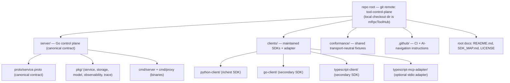

# Repository Structure

> One Go server (source of truth) + three maintained client SDKs + shared
> transport-neutral conformance fixtures. Generated/vendored code (`.proto`
> stubs, `.venv`, `node_modules`, `dist`, `bin`) is excluded from this map.

## Core Sections (Required)

### 1) Top-Level Module Map

### 2) Directory Layout (raw listing)

Plain indented listing (indentation = nesting depth). Note: the git remote is
`github.com/Abhishek-chohan/tool-control-plane` (the intended slug); the local
checkout directory happens to be named `mRpcToolHub`, which is purely cosmetic
and has no code impact.

- repo root (`tool-control-plane` remote; local dir `mRpcToolHub/`)
  - `README.md` — project intent, decision rule, support snapshot
  - `SDK_MAP.md` — per-RPC parity across SDKs
  - `LICENSE`
  - `.golangci.yml` — golangci-lint config (server + go-client)
  - `.github/`
    - `workflows/` — conformance-python, lint, proto-drift, release-gate
    - `instructions/` — per-area coding guidelines (`.instructions.md`)
    - `agents/` — `ai-native-repo.agent.md`
  - `server/` — Go control plane, the source of truth
    - `go.mod` — module `toolplane`, go 1.24
    - `Makefile` — build, gen-proto, release-gate, conformance targets
    - `Dockerfile` — multi-stage: builds server + gateway
    - `proto/`
      - `service.proto` — **CANONICAL contract** (5 gRPC services)
      - `service.pb.go`, `service_grpc.pb.go`, `service.pb.gw.go` — generated (tracked)
    - `cmd/`
      - `server/` — `main.go`, `config.go`, `tls.go`, `auth/`
      - `proxy/` — `main.go` (HTTP gateway), `config.go`, `circuit_breaker.go`, `rate_limiter.go`, `throttle_metrics.go`, `tls.go`
    - `pkg/`
      - `service/` — domain logic + gRPC adapter (`server.go`)
      - `storage/` — Postgres store (`*Store`), the `Storer` interface, migrations, per-entity stores, and a shared contract test suite
      - `storage/memory/` — in-memory `Storer` implementation for dev/CI memory mode
      - `model/` — `auth.go`, `request.go`, `task.go`, `tool.go`
      - `observability/` — `runtime_metrics.go` (Prometheus `/metrics`)
      - `trace/` — `tracer.go` (session lifecycle events)
    - `docs/` — operator-runbook, reference-deployment, reliability-drills, …
    - `scripts/` — `release_gate_observability.sh`, `reference_deployment_integration.sh`, …
    - `deploy/reference/` — `compose.yaml` + `certs/` (maintained prod topology)
  - `clients/`
    - `python-client/` — **PRIMARY** maintained SDK (gRPC + HTTP)
      - `pyproject.toml`, `requirements.txt`
      - `toolplane/` — `core/`, `http_core/`, `common/`, `interfaces/`, `factories/`, `session/`, `toolkits/`, `provider_runtime.py`
      - `tests/` — `conformance/` (runner+adapters), `test_grpc_tls`, `test_request_wrappers`
      - `example_client.py` / `example_user.py` — first-offload path
    - `go-client/` — **SECONDARY** SDK (gRPC lifecycle only)
      - `go.mod` — module `toolplane-go-client`
      - `client/` — `toolplane_client.go` (lib), `tls.go`, tests
      - `examples/` — `basic/` + `advanced/` demo consumers
      - `proto/` — generated (tracked)
      - `client.go` — runnable demo entry point
    - `typescript-client/` — **SECONDARY** SDK (gRPC + ProviderRuntime)
      - `package.json`
      - `src/` — `index.ts`, `core/`, `provider_runtime.ts`, `errors/`, `interfaces/`, `proto/`
      - `tests/` — `conformance/` + `unit/`
      - `scripts/` — run-tests, run-conformance-direct, copy-proto-assets
    - `typescript-mcp-adapter/` — **OPTIONAL** stdio MCP adapter (one session)
      - `package.json`
      - `src/` — `bridge.ts`, `cli.ts`, `config.ts`, `server.ts`, `resources.ts`, …
      - `tests/` — `integration.test.ts`
  - `conformance/` — shared transport-neutral behavior fixtures
    - `README.md`, `ARCHITECTURE.md`
    - `schema/test_case.schema.json` — fixture JSON schema (feature enum)
    - `cases/*.json` — session/request/tool/machine/provider fixtures

Note: `attached_assets/` holds stray CI logs (`ts_conformance_full.log`, etc.)
and is not part of the maintained product surface. `.tmp/`, `.pytest_cache/`,
`*/.venv*`, `*/node_modules/`, `*/dist/`, `server/bin/`, `server/.proto-venv/`
are build/runtime artifacts and are gitignored where applicable.

### 3) Entry Points

| Entry | Path | Role | Evidence |
|-------|------|------|----------|
| gRPC server binary | `server/cmd/server/main.go` (`make build` → `bin/toolplane-server`) | Canonical control plane: registers all 5 gRPC services | `server/Makefile:48-49`; `server/cmd/server/main.go:129-138` |
| HTTP gateway binary | `server/cmd/proxy/main.go` (`make build` → `bin/toolplane-gateway`) | grpc-gateway reverse proxy with CORS, rate-limit, circuit breaker | `server/Dockerfile:30`; `server/cmd/proxy/main.go:255-368` |
| Python SDK public API | `clients/python-client/toolplane/__init__.py` | Exports `Toolplane`, `ToolplaneHTTP`, `ProviderRuntime`, … | `SDK_MAP.md:72`; `__init__.py:1-40` |
| Python gRPC facade | `clients/python-client/toolplane/toolplane_client.py` | Richest end-to-end surface | `.github/instructions/proto-tracing.instructions.md` |
| Python HTTP facade | `clients/python-client/toolplane/toolplane_http_client.py` | Maintained HTTP gateway client | same |
| Go client library | `clients/go-client/client/toolplane_client.go` | gRPC lifecycle helpers (no provider runtime harness) | `SDK_MAP.md:73`; `go-client.instructions.md` |
| Go demo entry | `clients/go-client/client.go` | Runnable demonstration | `go-client.instructions.md` |
| TypeScript SDK public API | `clients/typescript-client/src/index.ts` | Exports `ToolplaneClient`, `ProviderRuntime` | `index.ts:1-23` |
| TS MCP adapter | `clients/typescript-mcp-adapter/src/index.ts` → `cli.ts` | Optional stdio MCP adapter | `SDK_MAP.md:80` |
| Canonical contract | `server/proto/service.proto` | 5 services, all RPCs and messages | `server/proto/service.proto` |

### 4) Non-Obvious / Hidden Directories

| Path | Purpose | Evidence |
|------|---------|----------|
| `.github/instructions/` | Per-area coding guidelines surfaced as Copilot-style instructions | `.github/instructions/*.instructions.md` |
| `.github/agents/` | AI navigation agent definition | `.github/agents/ai-native-repo.agent.md` |
| `.plans/roadmap-latest/` | Planning artifacts (referenced by AI-nav maintenance rules) | `.gitignore`; `ai-navigation-maintenance.instructions.md` |
| `server/client_protos/` | Vendored client-side proto copies (generation intermediates) | `server/Makefile:4-27` (`PROTO_DRIFT_FILES`) |
| `server/gen/openapiv2/` | Generated OpenAPI v2 from grpc-gateway | directory listing |
| `server/google/api/` | Vendored `google.api.http` annotations for protoc | `server/Makefile:71` |
| `conformance/schema/` | The fixture contract (JSON schema + `feature` enum) | `conformance/schema/test_case.schema.json` |
| `server/deploy/reference/` | Maintained production topology (`compose.yaml` + `certs/`) | `server/deploy/reference/compose.yaml` |

### 5) Naming Conventions (directories)

- **Go server**: standard Go layout — `cmd/<binary>/main.go`, `pkg/<domain>/`,
  flat domain files inside `pkg/service/` (`requests.go`, `machine.go`, …).
- **Python client**: `snake_case` package/module names; layered sub-packages
  (`core/`, `http_core/`, `common/`, `interfaces/`, `factories/`).
- **TypeScript client**: `kebab-case` package dirs, `camelCase` source files.
- **Client SDK dirs**: `kebab-case` with `-client` suffix (`python-client`,
  `go-client`, `typescript-client`); adapter uses `-mcp-adapter`.

### 6) Evidence

- `server/Makefile`, `server/cmd/server/main.go`, `server/cmd/proxy/main.go`
- `server/proto/service.proto`
- `server/pkg/` directory listing; `server/deploy/reference/compose.yaml`
- `clients/python-client/toolplane/__init__.py`
- `clients/go-client/client/toolplane_client.go`, `clients/go-client/client.go`
- `clients/typescript-client/src/index.ts`
- `conformance/README.md`, `conformance/schema/test_case.schema.json`
- `.github/instructions/*.instructions.md`
- `SDK_MAP.md`
