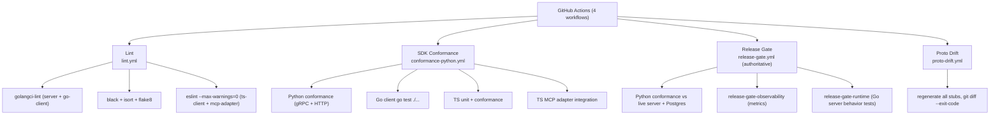

# Testing

> Toolplane is **conformance-driven**: shared, transport-neutral JSON fixtures
> in `conformance/cases/` are executed by SDK runners in Python and TypeScript,
> against a live server. Server-side behavior is covered by Go table-driven
> tests. The authoritative signal is the "release gate".

## Core Sections (Required)

### 1) Test Pyramid / CI Stages

### 2) Frameworks & Runners

| Surface | Runner | Evidence |
|---------|--------|----------|
| Go server (unit/integration) | Go `testing` | `server/pkg/service/*_test.go` (8 test files) |
| Go server cmd (config/TLS/auth/proxy) | Go `testing` | `server/cmd/{server,proxy}/*_test.go` |
| Go client | Go `testing` (+ testify, indirect) | `clients/go-client/client/*_test.go` |
| Python SDK | pytest (markers, `@pytest.mark.conformance`) | `clients/python-client/tests/conformance/test_conformance_runner.py`; `pyproject.toml:42` |
| TypeScript SDK | custom `scripts/run-tests.mjs` (unit + conformance) | `clients/typescript-client/package.json:16-21` |
| TS MCP adapter | custom runner / `npm test` | `clients/typescript-mcp-adapter/package.json`; `tests/integration.test.ts` |

Assertion libraries: Go stdlib assertions + testify (go-client); pytest `assert`;
TS uses the custom runner with `tests/conformance/assertions.ts`.

### 3) Test File Organization

- **Go**: tests live **alongside source** (`requests.go` / `request_runtime_test.go`,
  `request_stream_test.go`, `request_persistence_test.go`). Cmd-level tests in
  `cmd/<binary>/`.
- **Python**: `clients/python-client/tests/conformance/` (runner, adapters,
  assertions, conftest) + `tests/test_grpc_tls.py`, `tests/test_request_wrappers.py`.
- **TypeScript**: `clients/typescript-client/tests/unit/` (per-domain:
  admin/machine/provider/request/task client, grpc_tls) +
  `tests/conformance/` (runner, adapters, environment).
- **Conformance fixtures**: `conformance/cases/*.json`, validated against
  `conformance/schema/test_case.schema.json` (a `feature` enum is the
  authoritative case-family list).

### 4) Conformance Model (the primary guarantee)

From `conformance/README.md` + `conformance/ARCHITECTURE.md`:
- **Shared conformance**: Python and TypeScript execute every case over **both**
  `grpc` and `http` adapters. This is the primary public guarantee.
- **Focused integration**: Go provides opt-in live provider-backed gRPC coverage
  via `toolplane_client_integration_test.go` — supporting evidence, not full
  shared-fixture parity.
- Cases are transport-neutral; terminal statuses are `done` or `failure`.
- Coverage features: `session_create/list/update`, `request_create`,
  `tool_discovery`, `invoke_unary`, `invoke_stream`, `api_key_lifecycle`,
  `machine_lifecycle` (+ drain under load), `provider_runtime` (unary claim/submit,
  stream append chunks, drain under load), `request_recovery` (chunk window,
  resume, trimmed window, expired window).

### 5) Mocking / Live-Service Strategy

- The server is run **live** for conformance. CI sets
  `TOOLPLANE_CONFORMANCE_AUTO_BOOT=1` plus dev auth/storage env, so the runner
  boots a real server process (and gateway) and exercises it end to end
  (`.github/workflows/conformance-python.yml:66-76`).
- **Release gate** additionally uses a real Postgres 16 service container
  (`release-gate.yml:23-36`) to prove durable recovery.
- Go server unit tests construct services directly with an in-memory or test
  store (e.g. `request_persistence_test.go`).
- The Python client has `@pytest.mark.conformance` to separate the
  live-server suite; non-conformance tests (`test_request_wrappers`) run
  without a server.

### 6) Authoritative Release Gate

`make release-gate` (`server/Makefile:110-122`) chains three stages:
1. Python conformance against the configured storage (postgres in CI).
2. `release-gate-observability` (`scripts/release_gate_observability.sh`).
3. `release-gate-runtime` — a curated set of named Go tests proving:
   production-config rejection of in-memory storage, audit events, task
   cancel/timeout → request cancel, lease-expiry requeue (in-memory +
   persistent), drain waits for in-flight work, and `ResumeStream` retained /
   trimmed / expired-window behavior.

### 7) Coverage Thresholds

- Python coverage is configured (`pyproject.toml:118-133`) with source/omit/
  exclude rules, but **no enforced threshold** is visible. [TODO] — confirm
  whether a coverage gate is intended.
- No `.nycrc` / Jest coverage threshold for TypeScript; `npm test` runs
  `test:unit` only by default (`package.json:16-17`).

### 8) Evidence

- `.github/workflows/{lint,conformance-python,release-gate,proto-drift}.yml`
- `server/Makefile:99-124`
- `server/pkg/service/*_test.go`, `server/cmd/**/*_test.go`
- `clients/python-client/tests/conformance/test_conformance_runner.py`
- `clients/typescript-client/package.json:7-23`, `clients/typescript-client/tests/`
- `conformance/README.md`, `conformance/schema/test_case.schema.json`
- `clients/python-client/pyproject.toml:118-133`
